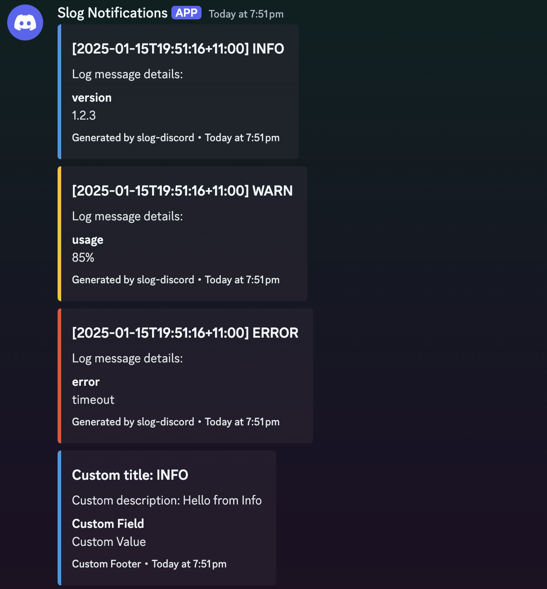

# Slog Discord Handler

A custom [slog](https://pkg.go.dev/log/slog) handler for [Discord](https://discord.com) that can send structured logs directly to Discord using a webhook. It converts a log into a Discord Embed with optional customisation.



## ⭐️ Features
- **Flexible Embeds** – You can customise the embed title, description, colours, footers, etc.
- **Log Level Colours** – Configure distinct colours for INFO, WARN, ERROR, etc.
- **Structured** – Embrace key-value pairs, grouping, and other slog superpowers in your logs.

## 🚀 Install
```
go get github.com/Bufferoverflovv/slog-discord
```
*Compatible with go versions >= 1.21*

## 🪵 Usage
### Requirements 
Create a discord [webhook](https://support.discord.com/hc/en-us/articles/228383668-Intro-to-Webhooks) in the channel you want to log notifications to be sent to
### Configuration 
`DiscordWebhookConfig` configures how logs are sent to discord
```go
type DiscordWebhookConfig struct {
    MinLevel slog.Level // Set the minimum slog level (Default: Debug) : Optional
    Timeout time.Duration // Set the timeout (Default: 5 Seconds) : Optional
    WebhookURL string // The webhook URL from discord 
    Username string // Set a custom username : Optional
    AvatarURL string  // Set a custom avatar : Optional
    LevelColors LevelColors // Customise the colours for each slog level : Optional
    CustomEmbed CustomEmbed  // Customise the embed content : Optional
}
```
### Basic Setup (Default Embed)
By default you do not need to add any customisations and can simply get going by creating a `NewDiscordHandler` 
```go
package main

import (
    "log/slog"

    slogdiscord "github.com/Bufferoverflovv/slog-discord"
)

const (
    WebhookURL string = "DISCORD WEBHOOK URL HERE"
)

func main() {
    default_example()
}

func default_example() {
    // 1) Configure how you want your Discord logs to look
    cfg := slogdiscord.DiscordWebhookConfig{
        WebhookURL: WebhookURL,
    }

    // 2) Create your Discord handler
    discordHandler := slogdiscord.NewDiscordHandler(cfg)

    // 3) Create a slog.Logger
    logger := slog.New(discordHandler)

    // 4) Log away!
    logger.Info("Hello from Info", "version", "1.2.3")
    logger.Warn("Watch out, memory usage is high", "usage", "85%")
    logger.Error("Oh no, database connection failed", "error", "timeout")
}
```
### Custom Embed 
If you want to customise the embed (like changing the title, description, or footers), provide your own function. For example:
```go
func custom_example() {
    // 1) Configure how you want your Discord logs to look
    cfg := slogdiscord.DiscordWebhookConfig{
        MinLevel: slog.LevelDebug,
        Timeout: 5 * time.Second,
        WebhookURL: WebhookURL,
        Username: "Slog Notifications",
        LevelColors: slogdiscord.LevelColors{
            "DEBUG": 0x95a5a6, // Gray
            "INFO": 0x3498db, // Blue
            "WARN": 0xf1c40f, // Yellow
            "ERROR": 0xe74c3c, // Red
        },
        // Optional custom embed function. If omitted, a default is used.
        CustomEmbed: func(r slog.Record, lc slogdiscord.LevelColors) *slogdiscord.DiscordEmbed {
            // custom formatting
            return &slogdiscord.DiscordEmbed{
                Title: fmt.Sprintf("Custom title: %s", r.Level.String()),
                Description: fmt.Sprintf("Custom description: %s", r.Message),
                Color: lc[r.Level.String()],
                Timestamp: time.Now().Format(time.RFC3339),
                Fields: []slogdiscord.EmbedField{
                    {
                    Name: "Custom Field",
                    Value: "Custom Value",
                    Inline: true,
                    },
                },
                Footer: &slogdiscord.EmbedFooter{
                    Text: "Custom Footer",
                },
            }
        },
    }

    // 3) Create your Discord handler
    discordHandler := slogdiscord.NewDiscordHandler(cfg)
        
    // 4) Create a slog.Logger
    logger := slog.New(discordHandler)

    // 5) Log away!
    logger.Info("Hello from Info", "version", "1.2.3")
    logger.Warn("Watch out, memory usage is high", "usage", "85%")
    logger.Error("Oh no, database connection failed", "error", "timeout")
}
```

### Structured Logging
slog supports structured logging with **attributes** (key-value pairs) and **grouping**. These show up as fields in your Discord embed.

**WithAttrs**
WithAttrs sets up **global** attributes applied to each subsequent log:
```go
logger := slog.New(slogdiscord.NewDiscordHandler(cfg)).
    WithAttrs([]slog.Attr{
        slog.String("env", "production"),
        slog.Int("version", 2),
    })

// Now all logs will carry env=production and version=2
logger.Info("Server started!")
```

**WithGroup**
WithGroup logically groups attributes under a named “folder”:
```go
logger := slog.New(slogdiscord.NewDiscordHandler(cfg)).
    WithGroup("request").
    WithAttrs([]slog.Attr{
        slog.Int("id", 42),
        slog.String("user", "Jordan"),
    })

// In a structured format, these might nest under "request.id", "request.user"
// For the embed fields, they just appear as separate fields, but you could
// alter the embed logic to visually reflect grouping if you want.
logger.Info("Handling user request")
```

## 📝 Examples 
Check out the [examples](./examples) folder for:
• **Basic example**: Logs to Discord only.
• **Custom embed**: Showcases how to override the default embed.

## ❓FAQ
1. **What if I need to also log locally?**
	- You can create a “multi-handler” approach (one logs to Discord, the other logs locally) if you **combine** them, or you can build a single handler that calls a “next” local handler. Either way, you do not have to limit yourself to only Discord.
2. **How do I prevent spamming Discord?**
	- You can implement rate limiting or batching. For heavy logs, consider sending only WARN or ERROR to Discord.
3. **Do I need a connection pool?**
	- Probably not. HTTP is stateless, and the Go http.Client already manages keep-alives. Discord also enforces rate limits, so a pool wouldn’t help much.
5. **What if I get a** `nil pointer dereference`**?**
	- Make sure your handler references are properly set. 
1. **I keep seeing “400 Bad Request” or "429 Rate Limit Exceeded"!**
	- Double-check your webhook URL, or confirm that you’re not violating any Discord request size/rate limit.
## ❤️ License and Contributions
This project is licensed under the [MIT License](LICENSE). You’re free to use, modify, and distribute it.

You are more than welcome to  contribute if you see room for improvement—**PRs are always welcome**

---
**Enjoy sending your logs in style to Discord!** If you need help or want a new feature, open an issue or drop a PR!